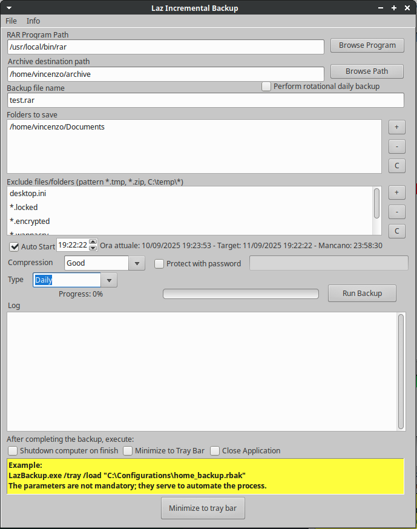
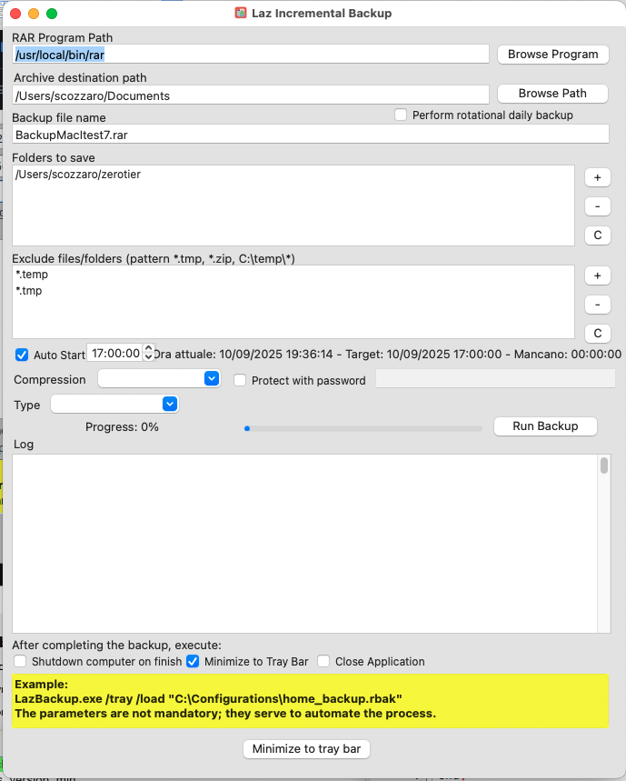
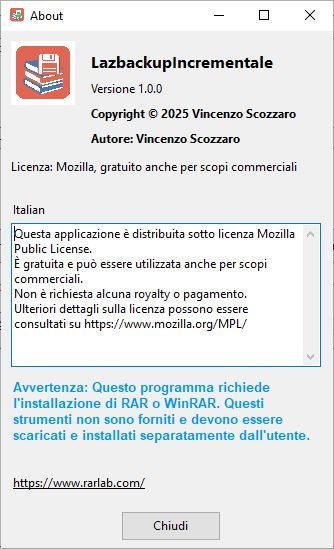

LazBackupIncrementale
I'm very pleased to share this backup software with the Lazarus community—a project I hope many of you will find useful.

Overview
This backup program, developed with Lazarus, is a robust and versatile solution designed to meet backup needs on Windows, macOS, and Linux platforms.

The program is built around the reliable RAR compression tool, offering an intuitive graphical interface that makes the process of incremental backup both simple and fast. Its cross-platform nature ensures that users can protect their data regardless of the operating system they use. To function, the program requires that RAR or WinRAR be installed separately on the system.

Key Features
Incremental Backup: Thanks to RAR's -u option, the program performs incremental backups. This means that only new or modified files are added to the archive, saving time and disk space with each execution.

Advanced File Management: You can exclude specific file types from the backup (such as temporary files or those infected by ransomware), ensuring the archive contains only useful and secure data. Users can also include an unlimited number of folders in the backup process.

Automation and Scheduling: The program offers scheduling options for backups at a pre-set time, with the ability to choose a daily, weekly, or monthly frequency.

Flexible Execution Modes:

Tray Mode: The application can be launched directly into the system tray (/tray), running in the background without cluttering the desktop.

Automatic Configuration Loading: If a configuration file (.rbak) is saved, the program loads it automatically on the next launch, or it can be loaded manually using the /load parameter.

Security and Control: Users can set a password to encrypt the archive, making sensitive data more secure. Additionally, you can choose from various compression levels to balance speed with storage efficiency.

Improved User Experience: At startup, a splash screen provides a welcome interface, while a progress bar and a real-time log inform the user about the status of the backup process.

License
This software is distributed under the Mozilla Public License (MPL), which allows you to use, modify, and redistribute the source code in compliance with the terms of the license.

