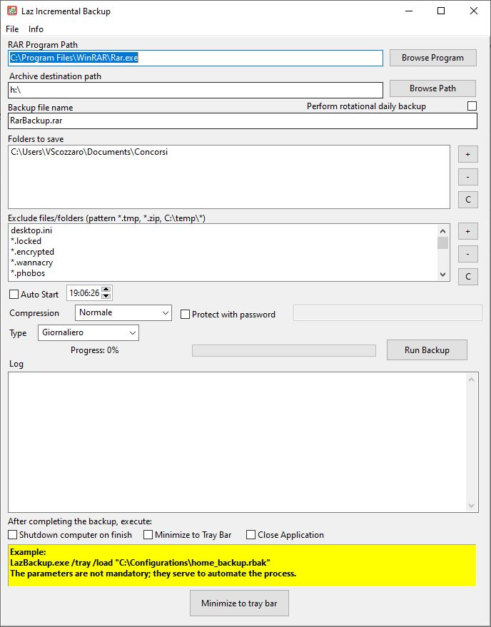

LazBackupIncrementale
Un programma multipiattaforma (Windows, macOS, Linux) per la creazione di backup incrementali e completi, utilizzando il software di compressione esterno RAR/WinRAR.

Caratteristiche Principali
Backup Flessibile: Seleziona facilmente le cartelle che desideri includere nel tuo backup.

Esclusioni Personalizzabili: Escludi specifici tipi di file dal backup per ridurre la dimensione dell'archivio, ad esempio file temporanei, log o file di sistema.

Supporto Multipiattaforma: Funziona su sistemi operativi Windows, macOS e Linux, offrendo un'unica soluzione per diverse piattaforme.

Gestione della Configurazione: Salva le tue impostazioni di backup in un file di configurazione per un uso rapido e ripetibile. All'avvio, il programma carica automaticamente l'ultima configurazione salvata.

Log Dettagliato: Genera un file di log completo che registra tutte le operazioni e gli eventi durante il processo di backup, utile per il debug e il monitoraggio.

Integrazione con RAR/WinRAR: Sfrutta il motore di compressione potente di RAR per creare archivi efficienti e protetti. Nota: è necessario che RAR/WinRAR sia già installato sul sistema.

Requisiti di Sistema
Sistema operativo: Windows, macOS o Linux.

Programma di compressione RAR/WinRAR (deve essere già installato e accessibile dal PATH di sistema).

Licenza
Questo software è distribuito sotto la Licenza Pubblica Mozilla 2.0 (MPL-2.0). È un software libero e gratuito, utilizzabile anche per scopi commerciali. Per i dettagli completi, consulta il file LICENSE.

Come Contribuire
Siamo aperti a contributi di ogni tipo: segnalazioni di bug, richieste di funzionalità e miglioramenti al codice. Per maggiori informazioni, consulta la nostra guida per i contributori.

